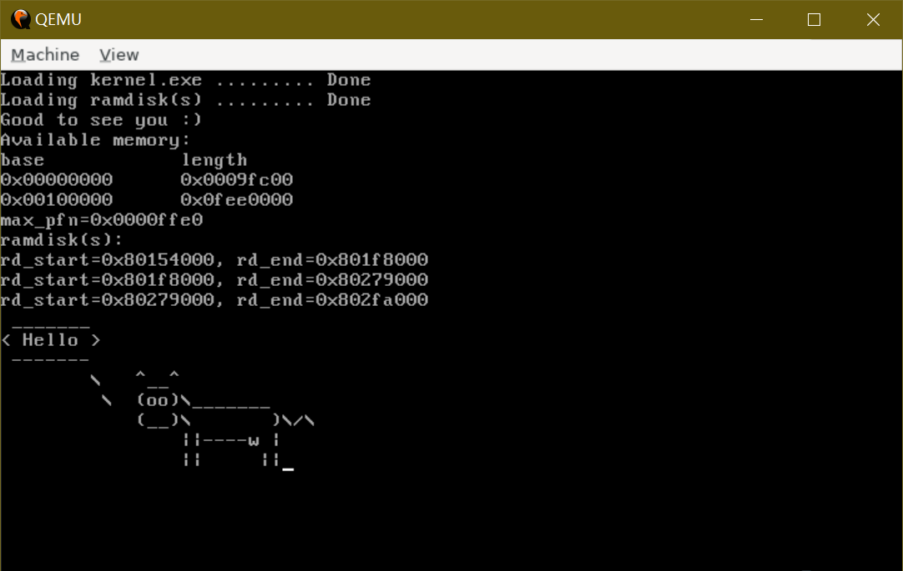

A simple UNIX-like OS for x86.



## TODO

* TTY driver
* pipe

## How-to

### prerequisites

```
$ sudo dnf install make gcc nasm qemu-system-x86
```

### build the kernel (and the bootloader)

```
$ make kernel
```

### prepare the root filesystem

```
$ make rd
```

### create the harddisk image used by qemu

```
$ make image
```

### run

```
$ make run
```

### debug

```
$ make debug
```

```
$ ./gdb.sh
```
