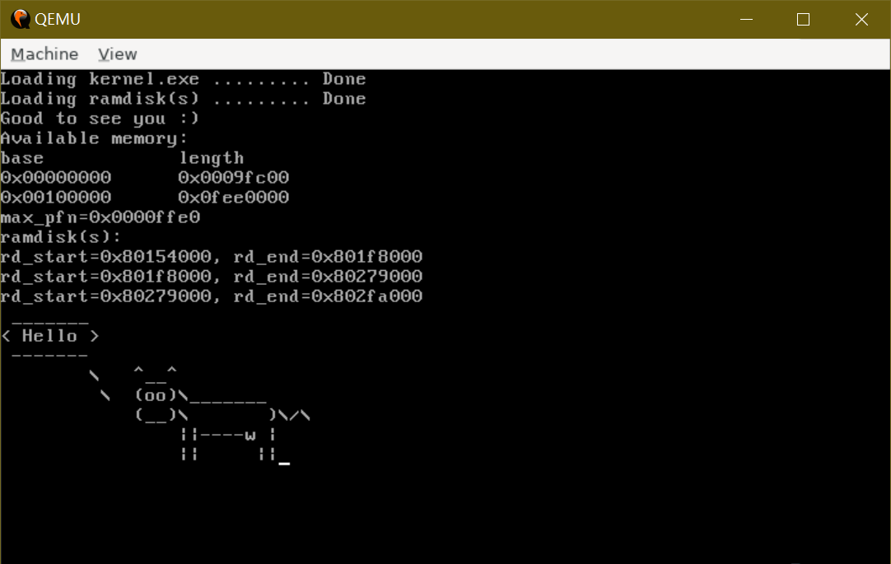

A simple UNIX-like OS for x86.



## Prerequisites

```
$ sudo dnf install make gcc binutils nasm qemu-system-x86 gdb
```

```
$ sudo dnf install socat tmux
```

## Build

```
$ make
```

## Run

```
$ make quick-run
```

## Debug

```
$ make quick-debug
```

```
$ ./gdb.sh
```
