A simple Linux clone for x86.

## Screenshots

**startup**

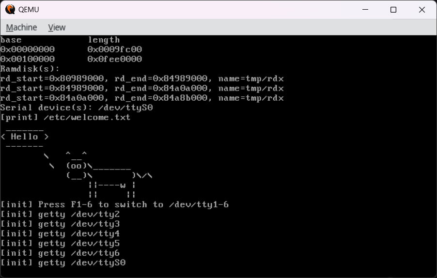

**oksh**

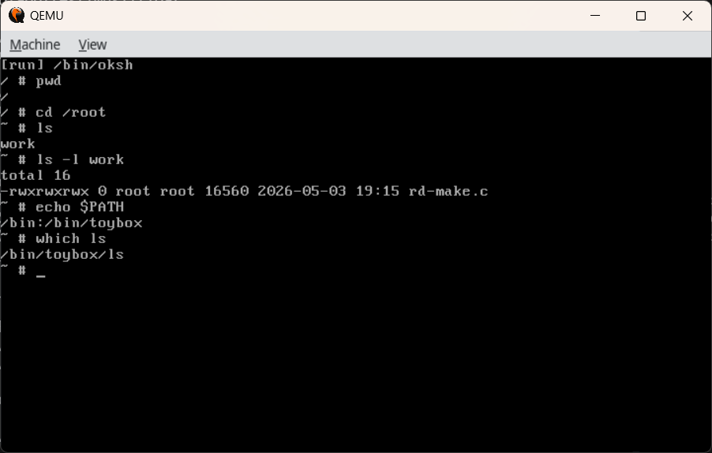

**vim**

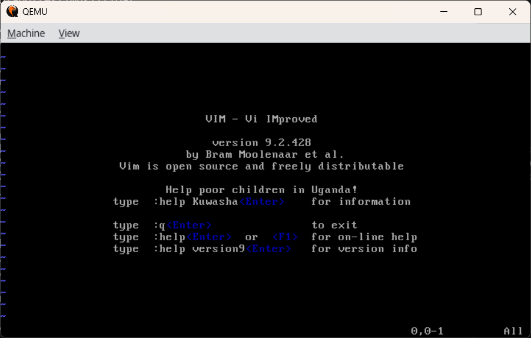

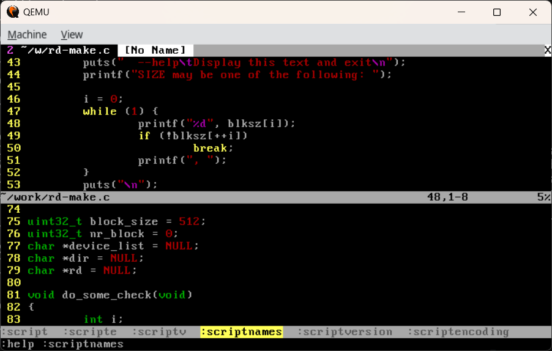

**nano**

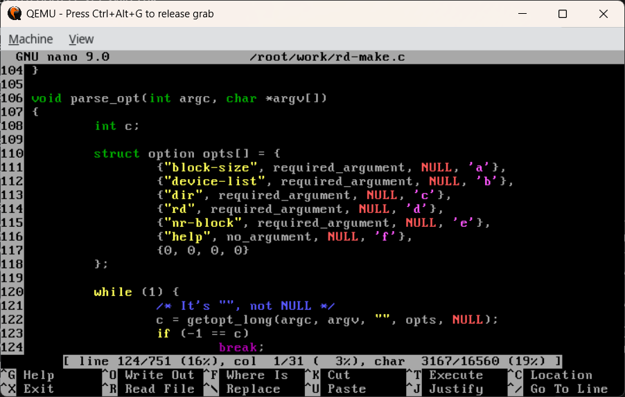

**less**

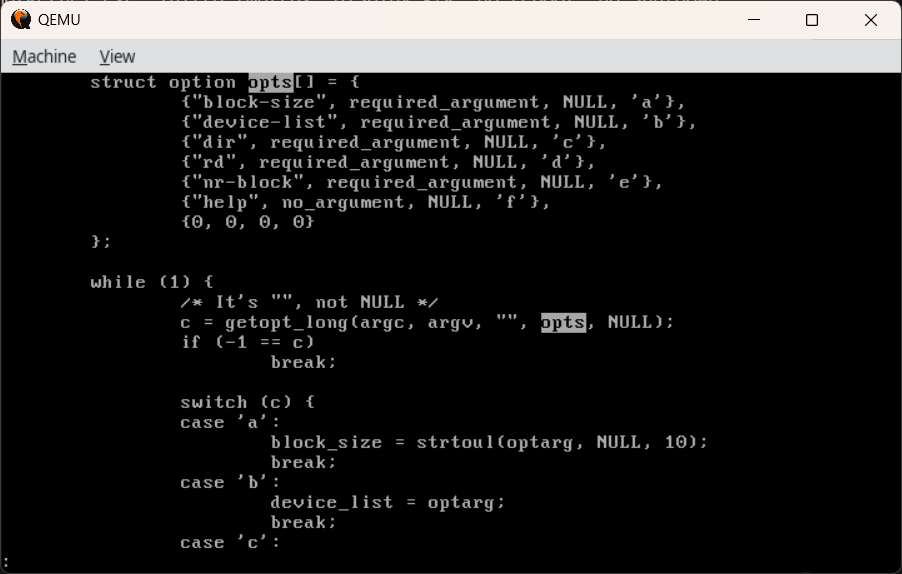

**python**

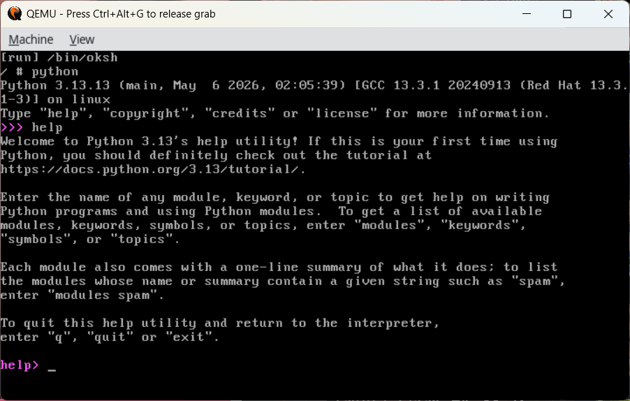

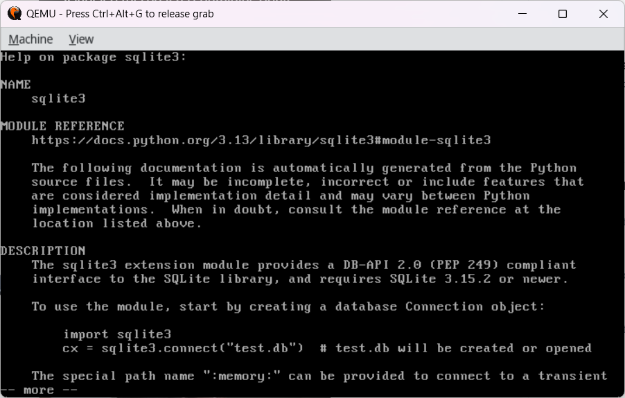

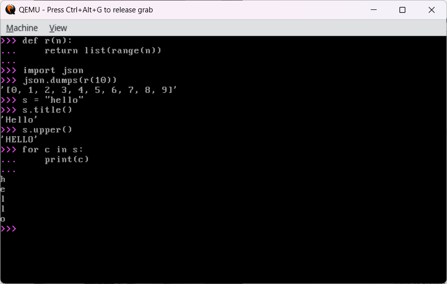

**cmatrix**

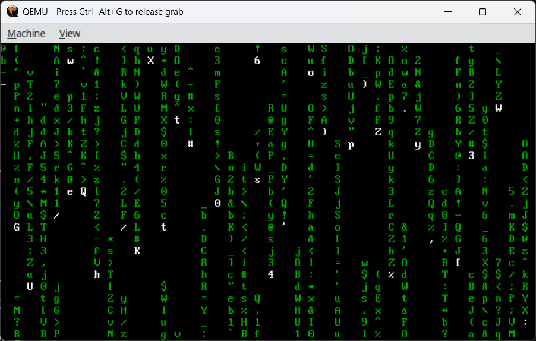

**2048**

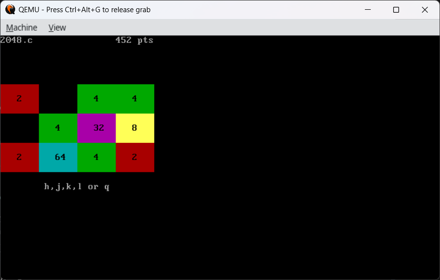

## Prerequisites

```
$ sudo dnf install make gcc binutils nasm qemu-system-x86 gdb

$ sudo dnf install wget

$ sudo dnf install autoconf automake libtool

$ sudo dnf install socat tmux
```

## Build

```
$ make
```

## Run

```
$ make quick-run
```

```
$ make quick-run-gtk
```

## Debug

```
$ make quick-debug
```

```
$ make quick-debug-gtk
```

```
$ ./gdb.sh
```
